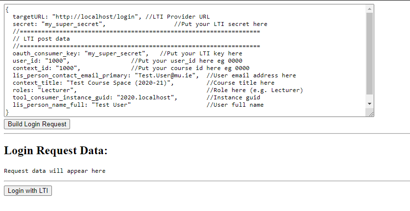
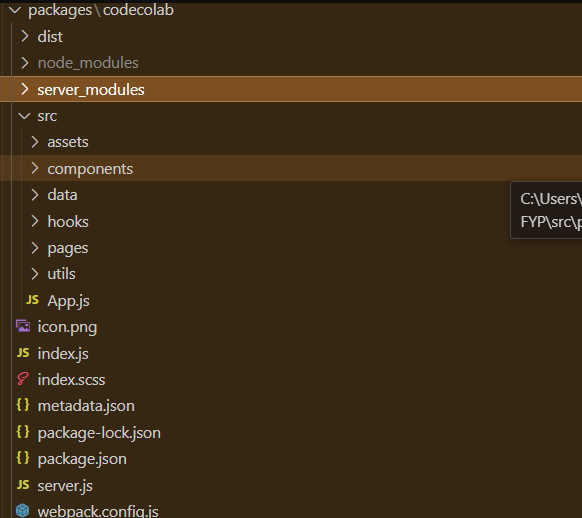

# Codecolab

## Description
This project is a plugin that has been built inside OS.js. MULE itself is a plugin built on top of OS.js's framework with multiple packages that allow it to create
a learning environment for Maynooth university students. Codecolab (the project itself) has been installed inside MULE as a plugin to allow for anyone using the
MULE environment to have the ability to collaboratively edit code documents in real time with their friends. Once MULE has been installed on your machine using 
Docker, MULE should be running on port 80. Codecolab will be located in the menu on the top left under the 'Other' menu item. 

## Installation
This will guide you to enable you to be able to install and build MULE with the codecolab plugin already installed. Please note that wsl2 and docker is slow
and it will take time for the application to work properly if you are using a windows system. This is a known issue and is caused by windows and wsl2. I was
unable to find a solution to this so I used ubuntu to run and build the MULE container, I would recommend this approach to run and build the application if
possible.
1. Clone the repository:
    ```bash
    git clone https://github.com/aking-a/mule-code-system
    ```

2. Install the docker desktop:
    ```Website
    https://www.docker.com/products/docker-desktop/
    ```
3. Enable Linux subsystem wsl2 if you are using windows:
    ```wsl setup instructions
    https://learn.microsoft.com/en-us/windows/wsl/install
    ```
4. Build and Run the container:
    ```bash
    docker-compose up -d
    ```
5. Open your browser on localhost:
    ```localhost
    http://localhost:80/
    ```
## Usage
1. _Login:_
   If the container has been built correctly you will be greeted with a login page. In the MULE repo
   navigate to the 'index.html' file in the .login folder.
2. _Open with Live Server:_
   Install the Live Server extension for visual studio code and open the index.html file. You should see this
   page below. Do not change any of the variables! Click the **build login request button** and then click the
   **Login with LTI button**.
   
3. _Logged in:_
   You should be navigated to the MULE web desktop which should look like the screenshot below. If you have not been relocated to
   the MULE try opening localhost in a new tab.
   
5. _Open Codecolab:_
   Navigate to the top left menu button click on it then click the **Other** menu item then
   **codecolab**. The application landing page should open and look like the screenshot below.
   
7. _Share file:_
   Click the share file button as instructed and select a file from MULES virtual file system. You should then
   be navigated to the main window which is the code editor and it should look like the screenshot provided.
   
9. _Other Users:_
   Using the share link you can copy and paste this into a new tab and it will join that session that
   has been created. You can now start editing the document on either tab and you should see the changes be reflected
   in both tabs. Below is a screenshot of what the user that joined the session through the link should look like.
   Please note that the menu for other users that join the session is disabled so you will not see it on the
   second tab.
   
   

## Contributing
_Please follow these steps to contribute to the project:_
I personally used the OS.js documentation to create a application inside OS.js and then I copied and pasted that application
into MULE's directory specifically in **mule/src/packages**. I found it easier to build and test the application without
Docker and then build the container once the finished product had been realised.
1. _Building an application in OS.js:_
   Go to OS.js and clone its repository the instructions to set it up on your own machine are explained there. Use the non-docker
   setup instructions!
     ```OS.js
     https://manual.os-js.org/
     ```
2. _Copy codecolab and build:_
   Copy the codecolab folder from the MULE repo provided above and copy it into **src/packages** in the OS.js repository on your machine.
   Assuming you have OS.js running on your local machine stop it and run the commands below. Do not copy the dist and node_modules package from
   codecolab!
     ```cd
     cd src/packages/codecolab
     ```
     ```install
     npm install
     ```
     _cd back out of src/packages/codecolab_
     ```package:discover
     npm run package:discover
     ```
     ```run build
     npm run build
     ```
3. _Serve and Watch:_
   Once the build command has run successfully codecolab will now be installed as a package. Use the **npm run serve** command to start OS.js
   it should be running on **http://localhost:8000/**. _(An important note to mention is the invite link generator does not take into_
   _account what port or URL the server is running on so please change this in the source code. The link generator is located in codecolab_
   _/server-modules/newsession.js line 15.)_. To run a watch on codecolab package use the commands provided below.
    ```
    cd src/packages/codecolab
    ```
    ```
    npm run watch
    ```

## Design Explained
This section will cover OS.js's overall architecture and codecolabs files and structure along with libraries and packages used.

_This is a screenshot from OS.js that provides a high-level overview of how it's framework works_


This image shows how applications are built inside a window and contained within OS.js web desktop.

Codecolab itself is an application and through the use of react I was able to render a react app inside
one of these windows. The react app navigates to its different routes using a react library called BrowserRouter.
The OS.js itself along with all of its packages is bundled and served using webpack therefore _I would recommend
researching react and webpack before attempting to make changes to this repo and of course research the OS.js
documentation._

**codecolab file structure and file functionality:**



_Screenshot of codecolab's file structure_

**Top Level**
As seen in the screenshot above the top level contains the folders assets, components, data, hooks, pages, utils.

- _Assets_ contains all the styling for the pages and components in the app.
- _components_ contains all the components for the app such as the dropdown menu and buttons.
- _data_ contains all the session data such as the file being used and the Monaco editor options.
- _hooks_ contains all the react hooks used in the app.
- _Pages_ contains the pages/routes that the application uses
- _Utils_ contains important functions that are used in different parts of the application like on click events

**packages used:**
__These are the main packages used to create codecolab.__
- _Webpack_ This package is a key part of OS.js and is responsible for bundling and serving MULE/OS.js to the client.
- _React-Monaco-editor_ This is a IDE that can be used on a website. It is the same IDE that VSCODE uses and comes with
  a lot of helpful built in functionality such as _onDidModelChangeContent()_.
- _Babel-loader_ This is responsible for transpiling the js files.
- _CSS AND SASS loader_ This is responsible for transpiling the css files in the project.
- _React_ This is a well known UI package that is used for creating SPA's.
- _ws_ This a basic websocket package that allows for web socket servers to be created in addition to creating a connection between client and server.

**File Description**

Each file will now be explained:

- **index.js:** This is the entry point in the application and it is where the window is created. The react app is imported to this application and is rendered
  inside the window that has been created. The react app is attached to the _$content_ element. The apps relevant variables are stored inside AppData class
  object for later use. Below is a screenshot of the code performing this action. The socket connection to OS.js is also setup here.
  
  

- **App.js:** This is the main entry point for the react app. The '/' route is served unless it is a client connecting through on invite link then 'Landing'
  will be served to the client. The is all done through the Browser Router package and the navigate function.

- **Disconnect.js:** This is the disconnect button component. Its logic is handled in the _handleDiconnect_ function which basically sends a ws Json to the
  server telling it to remove that websoket from the session. It also uses the chakra UI library to help position it.
- **dropdown.js:** This is a component that constructs the dropdown menu for the app. The dropdown contains two options, save and user list. Save simply
  saves the file and user list lists the user in the session. The selection of a item in the menu is handled in handleSelect function. This component
  also sets up the usernames UseState array which keeps track of the users usernames that are connected to the session.
- **left_join_alert:** This is the popup component that appears when a user joins or leaves a session.
- **userlistwindow:** This is the component that is rendered inside the user list window. It is responsible for displaying the current list of users in a
  session.
- **appdata.js:** This is a class that is created in _index.js_ and stores all the app data such as core for later use in other files.
  Below is a screenshot of its contents.
  
  

- **editoroptions.js:** This is the options used for Monaco editor.
- **file.js:** This is a class object that stores the file path data and the content of the file after it has been loaded from OS.js's _vfs_.
- **sessionclass.js:** A lot of variables are stored in the session class as you might have noticed. This class object is created before
  the user is navigated to the main page and is interacted with throughout the app. It is basically makes the variables within it
  globally accessible to any file in the application. Below is a screenshot of the class.
  
  

- **useActionListener.js:** This file uses a hook that uses useEffect() from react to listen for changes in the document that Monaco has loaded.
  Once a change has been detected it packages that change and sends it to the server via the clientChange() function.
- **useDidMountListener.js:** Listens for the Monaco editor DIDMount and sets up the session by setting the userID code and other variables.
- **useListListener.js:** Listens for changes being made to the usernames list and applies the updated list to the itemlist in the
  _userlistwindow_. This causes the component to re-render the list when a new user joins or leaves.
- **useSetApp.js:** Stores the AppData class object so it can be retrieved from any file.
- **useShowPopupListener.js:** Shows the Popup for 3 seconds then sets the UseState to false to hide the popup.
- **useSocketListener.js:** Listens for incoming socket messages from the server and handles them.
- **fileselector.js:** This file is the landing page for creating a session. It just loads the svg icon and text. The click event is
  handled by the _clickEvent()_ function.
- **filesession.js:** This is the main page in the application and all the components are useHooks are imported and used here. The react-monaco-editor
  is used here and is rendered in this section. A lot of the useStates are also set up and used here.
- **joinlanding.js:** This is the alternate route that users that are joining a session take. The reason behind this was to skip the file selector as users
  joining a session are not allowed to select a file. Additionally it displays a flashing loading text while the user is joining the session.
- **clickevent.js:** This is responsible for handling the clickEvent from _fileselector_. It loads and stores the selected file data in the session class
  object.
- **renderlist.js:** Creates a new OS.js window and renders the list component inside it.
- **handlechnages.js:** Applies the incoming changes from the server to the document.
- **handledidmount.js:** Handles the did mount of the Monaco editor.
- **handleReadOnlyLines.js:** Makes lines read only by moving the cursor away from lines that are in the set of locked lines.
- **handlesocketoutgoing.js:** Handles the outgoing events that are sent to the websocket server.
- **getusername.js:** Gets the username that has been used to log into MULE or OS.js and applies a random number to it and returns it.
- **updateList.js:** Adds and removes usernames from the user list _(the list of users in the session)_.
-  **getSession.js:** Stores and Returns the _sessionclass_ object. It also has a function called _Terminate()_ that destroys the object.
-  **handleSelect.js:** Handles the selection of a menu item from the dropdown menu.
-  **openfile.js:** This file is responsible for loading a file from OS.js's _vfs_ using promises.
-  **savefile.js:** This file saves a file to OS.js's file system using the file data from the _fileclass_ object.
-  **server.js:** This server handles all the connected websockets and broadcasts changes to connected clients. Each session is stored in a
   _createnewsession_ class. This class stores all of the relevant data for a session such as the file being edited and a list of the
   websockets connected to that session. Then each of these classes is stored in a Json that is identifies using a crypto generated key
   which serves as it's unique identifier. All of the other cases are handled here aswell such as disconnect broadcast and acquiring locks
   etc.
- **onDisconnect.js:** This handles the broadcast when a user disconnects or loses connection to the session. It also deletes the session
  and forces connected users to leave if the user that left is the admin. It will also remove connected clients from the client array if they
  are not an admin.
- **serverDocEditor.js:** This is responsible for modifying the document state on the server.
- **tryoperation.js:** This file broadcasts the lock and release of a line.
- **linelock.js:** This is the logic that is responsible for locking the line.
- **newsession.js:** This creates an object that stores the session data. A new session object is created each time a user creates a new file sharing session.
  It also has _createShareLink()_ and _getLanguage()_ which is responsible for creating the share link and extracting the language of the file from its
  extension.
- **LinkHandler.js:** This file is contained outside the codecolab package and is used to handle the /open route for the invite link. It basically serves the
  extracts the sessionID passed through the link data and serves the index html of mule. It will then execute the javascript to open codecolab on the sessionID
  that was ectracted from the link. This service provider is always active on the server side. It was created through _npm make:serviceprovider_. This command
  is from the OS.js documentation  and more details on this can be found there. Here is a screenshot of the LinkHandler provider.
  
